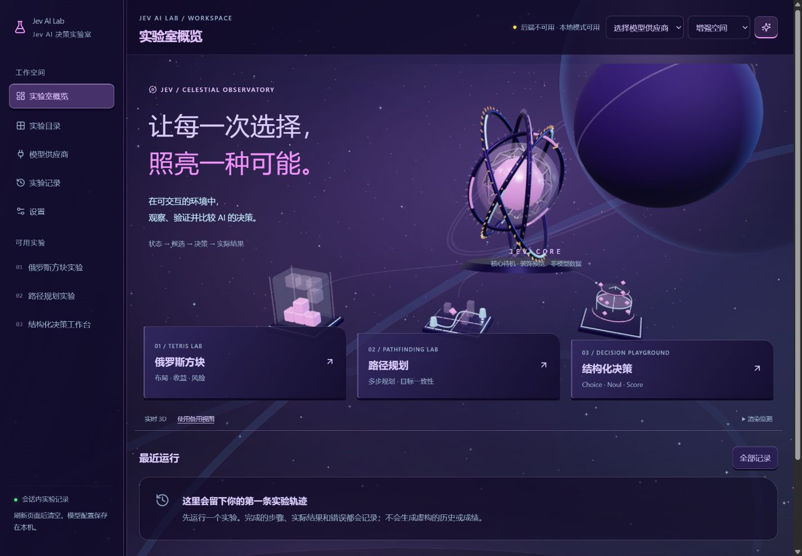

# Jev AI Lab

**Jev AI 决策实验室：把 AI 的选择，变成可观察、可验证、可比较的实验。**

在俄罗斯方块、路径规划和结构化决策场景中，观察环境提供了什么信息、程序生成了哪些合法选择、模型选择了什么，以及选择实际产生了什么结果。

默认无需 API Key，即可通过本地模拟体验完整流程。需要真实模型时，在网页中配置供应商即可，无需修改源码。

首页默认展示实时 3D「星轨共振」：七层空心圆环沿纵深排列，中央是串珠状粒子光轴，外围三组五线谱承载沿轨道流动的音符、星星和空心几何符号。镜头从首次加载开始始终保持斜前方方向，仅有轻微角度变化。首页只保留这一种装置及简洁的实验入口，不展示播放条、重播、渲染监测或装置切换。这些是装饰视觉，不代表模型数据，也不读取麦克风；减少动态模式静态呈现，离屏或后台暂停动画。

> 本项目是本机单用户实验工具。它不保证模型始终选择最优方案，也不把模拟数据或本地指标包装成模型能力、隐藏推理或真实成功率。

## 快速开始

### 环境要求

- Node.js **22.13 或更高版本**，建议使用 Node.js 24。
- npm，以及支持 Canvas、CSS 3D 和 WebGL 2 的现代浏览器（WebGL 不可用时实验功能仍然可用）。
- 无需单独安装数据库服务，后端使用 Node.js 内置 SQLite。

### 首次运行

在项目根目录打开终端：

```sh
npm install
npm run dev
```

访问 **[http://127.0.0.1:5174](http://127.0.0.1:5174)**。

一个命令同时启动前端和后端：前端端口为 `5174`，后端为 `3001`。Vite 会把 `/api` 请求代理到后端。体验本地模式不需要创建 `.env` 或填写密钥。

### 以后手动启动与关闭

当前电脑可以在 PowerShell 中运行：

```powershell
cd C:\Users\18246\Desktop\DropMind
npm run dev
```

保持终端打开即可使用。在该终端按 **Ctrl+C** 停止服务。依赖已安装时，不需要每次执行 `npm install`。

如果项目放在其他目录，请将 `cd` 后面的路径替换为实际目录。

### 使用生产构建在本机运行

```sh
npm run build
npm start
```

访问 **[http://127.0.0.1:3001](http://127.0.0.1:3001)**。此时由 Express 同时提供页面与 API，不需要运行 Vite。

## 选择一个实验

| 实验                                 | 主要观察能力                   | 可用模式                      |
| ------------------------------------ | ------------------------------ | ----------------------------- |
| **俄罗斯方块 · Tetris Lab**          | 空间布局、短期收益与堆叠风险   | Mock、本地策略、真实 AI、手动 |
| **路径规划 · Pathfinding Lab**       | 多步规划、目标一致性与避免循环 | Mock、本地 BFS、真实 AI       |
| **结构化决策 · Decision Playground** | 问题设计、结构化判断与响应校验 | Mock、真实 AI                 |

### 俄罗斯方块

程序先通过 BFS 搜索当前方块实际可达的落点，保存动作路径并计算消行、高度、洞数等指标。模型选择完整候选 ID，本地再执行移动、旋转与硬降。

- 10×20 棋盘、7 种方块、固定种子与 7-bag。
- 开始、暂停、继续、重开，以及完成一个方块落地后自动暂停的单步执行。
- 1x、2x、4x 控制动作展示速度，不加速模型响应或绕过调用预算。
- 区分直接硬降投影、目标落点和历史快照。
- 手动模式支持 ← / → 移动、↑ 顺旋、Z 逆旋、↓ 软降、空格硬降。

AI 模式采用回合制：等待决策时暂停重力。手动模式使用正常自动下落。旋转、锁定、计分、候选指标和启发式权重详见 [俄罗斯方块规则](docs/TETRIS.md)。这是明确的简化规则，不宣称完整实现官方竞技规则。

### 路径规划

在完全可见的 12×12 网格上，从起点移动到终点。固定种子生成的默认地图保证可解；暂停时可点击格子编辑障碍。修改后的地图若不可解，会阻止运行。

每轮只提供合法相邻动作，真实模式执行模型返回的动作 ID。本地 BFS 是单独标记的基线；发生错误并启用兜底时，才使用本地策略替代。

支持开始、暂停、单步和重置，最多可设置 500 步。界面记录实际步数、最短路径步数、重复访问次数、请求次数和耗时，并区分成功、失败、取消与步数耗尽。

### 结构化决策工作台

使用虚构的“客服工单分流”或“任务优先级选择”模板，编辑 `state` 和 `questions`，执行一次决策并检查响应。

- `state` 使用 JSON 编辑。
- `questions` 支持表单和 JSON 编辑，显式选择 `choice`、`noul`、`score`。
- 非法输入显示具体错误位置，修复前不能发送。
- 支持 1～32 个问题、每道 choice 1～255 个候选、每道 score 2～10 个级别。
- 单次执行，不自动循环，不执行真实业务操作。

## 观察决策与保存记录

三个实验共用同一条流程：

```text
配置实验 → 观察状态 → 生成候选 → 请求决策 → 校验结果 → 执行动作 → 回看记录
```

观察台提供 **概览、候选、请求与响应、步骤记录**。数据来源明确区分：真实模型、Mock 模拟、本地策略和错误后的兜底。模型选择、本地基线与实际执行分别展示。

| 数据                   | 保存位置                         | 刷新或重启后的行为     |
| ---------------------- | -------------------------------- | ---------------------- |
| 供应商配置、当前供应商 | 后端 SQLite                      | 保留                   |
| API Key                | 后端加密存储或明确标记的内存模式 | 取决于 MASTER_KEY 配置 |
| 非敏感实验及显示设置   | 浏览器 localStorage              | 保留                   |
| 实验运行与步骤记录     | 当前页面内存                     | **刷新即清空**         |

会话最多保留最近 100 个运行。Tetris 保留每运行最近 100 条决策及动作记录；路径保留运行步骤；工作台保留单次结果。离开未完成的实验会将该运行标为取消，历史详情明确标记为非实时环境。

可导出全部或单次运行的脱敏 JSON，包含实验与基线版本、种子、参数、初始状态、模型摘要、身份、实际动作和结果。数值用量字段如 `input_tokens`、`output_tokens` 会保留。

固定种子可以复现本地环境；结合相同动作序列可复现本地执行，但不能保证远端模型每次输出相同。

## 连接真实模型

1. 打开 **模型供应商**，点击 **添加供应商**。
2. 分别填写显示名称、接口协议、完整 Endpoint URL、API Key、模型 ID、超时和重试参数。
3. 如需验证，点击 **测试连接**。这会由后端发送一次小型实际决策请求，可能产生费用；保存前也可以测试，连接测试不自动重试。
4. 保存配置并 **设为当前**。
5. 回到实验，切换为 **真实 AI**，再开始或单步执行。

### 支持的协议

| 协议                 | 预设完整请求地址                            | 模型配置                         |
| -------------------- | ------------------------------------------- | -------------------------------- |
| OpenRouter Decisions | `https://openrouter.ai/api/alpha/decisions` | 示例 `typesafe/jev-1.13`，可编辑 |
| TypeSafe System One  | `https://api.typesafe.ai/v1/systemone`      | 用户填写，可编辑                 |
| 本地模拟             | 不需要远端地址                              | 无需 API Key，结果标记为 Mock    |

供应商名称只是标签，不决定协议。Endpoint 使用完整地址，不自动追加 `/v1` 或改写为聊天接口；可配置兼容协议的自定义 HTTPS 地址。

配置支持编辑、删除、复制、启用、禁用和设为当前。复制不携带密钥；编辑密钥留空表示保留，清除密钥为独立操作。修改协议、地址、模型或密钥后，旧连接测试结果失效。

**OpenAI Chat Completions 和 Anthropic Messages 尚未实现，在界面禁用。** 普通聊天接口不能作为 Decisions 协议的别名使用。

## Jev 的数据结构

| 字段        | 含义                                                              |
| ----------- | ----------------------------------------------------------------- |
| `state`     | 当前环境，以及程序计算的候选和指标；工作台中为用户编辑的场景 JSON |
| `questions` | 需要模型回答的问题，题型通过 `type` 显式指定                      |
| `criteria`  | 候选描述或评分标准，属于具体问题                                  |
| `answers`   | API 返回的同名、同题型答案                                        |

外部决策请求结构为：

```ts
const payload = {
  model: provider.modelId,
  state,
  questions,
};
```

- **choice**：选择一个已提交候选 ID。概率键集合必须与候选匹配，每项有限且位于 `[0, 1]`，总和允许 `0.001` 的浮点误差。
- **noul**：对当前问题回答“是”的概率，不是现实中的失败率。
- **score**：范围为 `0` 到 `criteria.length - 1`，允许小数；Tetris 的棋盘质量范围为 `0～4`。
- **confidence**：不是“这步正确率”。未返回 confidence、usage 或 cost 时显示“未提供”。

Mock 概率明确标记为模拟值，本地基线不伪造概率。本地指标说明只解释计算结果，不代表模型隐藏推理。

## 星空与实时 3D

视觉方向是粉紫星云中的全息观测站，基础色精确继承 [tale-loom DESIGN.md](https://github.com/WXH666-bit/tale-loom/blob/main/DESIGN.md)。

- **首页**：Three.js 渲染圆环星轨共振，始终保持斜前方方向。下方三个对齐的中文入口启动真实实验；不再展示三个装饰模型、珠光核心或场景切换按钮。
- **统一观察台**：使用同一套真实 3D 核心，读取实际待机、请求、校验、执行、完成和错误状态。暂停时停止轨道推进。核心不是模型隐藏推理或请求进度百分比。
- **俄罗斯方块**：Canvas 倒角方块、透明 ghost、粉紫目标框和带厚度的实验槽；默认正视分析，可切换立体展示。消行光带来自实际落地姿态对应的原始行号，不影响规则或计分。
- **路径实验**：CSS 3D 沙盘、障碍柱、起终点信标、悬浮探针；能量线沿实际已走路径。提供俯视分析。
- **结构化工作台**：分层数据板预览绑定正在编辑的题目，保留正面的 JSON、表单和精确概率。

顶部可选择画质；首次打开默认为增强（保留用户已保存的选择）：

| 档位     | 像素比上限 | 3D 星点 / 轨道 | 渲染预算                        |
| -------- | ---------- | -------------- | ------------------------------- |
| 标准     | 1          | 160 / 3        | 30 FPS 上限、无透射             |
| 增强     | 1.5        | 360 / 4        | 60 FPS 上限、局部半分辨率透射   |
| 影院级   | 2          | 750 / 5        | 60 FPS 上限、更细几何和局部透射 |
| 减少动态 | 1          | 120 / 4        | 静态渲染，仅尺寸及状态变化更新  |

以上是预算，不是设备保证。系统减少动态设置优先；低核数或低内存提示设备使用标准档。离屏、后台暂停渲染；离开页面释放资源。画质不改变种子、候选、请求预算或动作。

首页不展示渲染监测、播放进度或重播等调试控件。未实现景深和全屏 Bloom，避免文本模糊与无差别高采样。

WebGL 不可用、资源加载失败或上下文中断时，首页隐藏装饰画布，实验入口仍然可用；观察台自动使用 CSS 备用装置。表单、模型配置和长文本始终使用 DOM，不随鼠标倾斜。

[视觉系统与材质说明](docs/VISUAL_SYSTEM.md) · [实际截图与验证](docs/VERIFICATION.md)



## 环境变量与密钥安全

需要持久化 API Key 时，将 `.env.example` 复制为 `.env`，配置后端主密钥：

```dotenv
PORT=3001
MASTER_KEY=
DATABASE_PATH=./data/jev.sqlite
```

| 变量            | 用途                                                                  |
| --------------- | --------------------------------------------------------------------- |
| `PORT`          | 后端监听端口，默认 3001；开发时修改需同时调整 Vite 代理及相关来源配置 |
| `MASTER_KEY`    | 32 字节 Base64 加密主密钥，与数据库分开保存                           |
| `DATABASE_PATH` | SQLite 路径，默认 `./data/jev.sqlite`                                 |

生成主密钥：

```sh
node -e "console.log(require('crypto').randomBytes(32).toString('base64'))"
```

API Key 通过网页输入，只交给本项目后端，不写入浏览器持久存储或从查询接口返回。持久化使用 AES-256-GCM，并以 providerId 作为附加认证数据。

未配置 `MASTER_KEY` 时，界面明确显示会话内存模式：供应商配置仍保留，密钥在后端重启后需要重新输入，不会明文落盘。已有密文必须使用原主密钥解密；不要随意更换主密钥，也不要提交 `.env`、密钥或数据库。

自定义 endpoint 仅允许无凭据、无 query/fragment、443 端口的 HTTPS。服务端检查 DNS/IP，拒绝私有、回环、链路本地和保留地址，固定连接到已验证 IP，并禁止跟随重定向。

服务默认绑定 `127.0.0.1`，检查 Host、Origin 和客户端请求头。公网访问所需的身份认证、多用户隔离和完整限流体系不在当前实现范围内。

## 请求控制与错误处理

身份包含实验、运行、步骤、状态版本、供应商配置版本和 requestId。暂停、重开、切换实验/模式/模型/配置或卸载页面时，取消或作废旧请求，阻止迟到结果影响新状态。取消不保证上游不会计费。

默认限制：

- 最小主要请求间隔：**2000ms**。
- 每运行主要请求上限：**100 次**。
- 连续失败阈值：**3 次**。
- 后端主要决策限制：**每分钟 60 次**。

仅对适合重试的 `408`、`429`、`5xx` 做有限重试，并考虑有上限的 Retry-After。认证、余额和明显格式错误不自动反复请求。重试与连接测试不计入前端主要请求计数。

Tetris 和路径可选择本地兜底或停止，错误原因和来源保留；工作台失败后停止，不生成替代业务判断。设置页可模拟 Mock 延迟、超时与错误。

## 开发与扩展

技术栈：React、TypeScript、Vite、Tailwind CSS、Canvas、CSS 3D、Three.js；Node.js、Express、Zod、SQLite；Vitest 与 Testing Library。

```text
frontend/src/
  App.tsx                   平台外壳、导航和全局配置
  lab/                      统一观察台、运行控制、记录和前端注册
  experiments/              路径规划与结构化工作台界面
  TetrisWorkspace.tsx       俄罗斯方块工作区
  hooks/useDecisionLoop.ts  Tetris 专属控制循环
  providers/                可视化供应商管理
  components/SpatialLab.tsx 空间装置与显示分级
  visual/                   实时场景、材质/质量 token、纯展示数据
  spatial.css               统一空间、表面与交互样式
backend/src/
  app.ts                    供应商与决策 HTTP 接口
  adapters/                 协议适配及响应校验
  services/                 SQLite、密钥与安全网络传输
shared/
  lab/                      公共契约、身份、预算、记录和脱敏
  experiments/              实验定义、注册、验证与纯函数
  game/                     Tetris 引擎、候选、指标与基线
tests/                      规则、契约、HTTP 与生命周期测试
```

公共接口为 `POST /api/lab/decisions`，前端提交 providerId、identity、state、questions，后端读取凭据并调用注册实验的校验器。公共解析器不强制要求 Tetris 字段；旧 `/api/decisions` 保留兼容。

添加第四个实验：

1. 在 `shared/experiments/` 定义元信息、输入验证、初始状态、候选、问题、执行、指标、终止条件和本地基线。
2. 加入 `shared/experiments/registry.ts`。
3. 实现前端组件，按需复用 `useLabRunner<S>`、`Workspace`、`Observer`。
4. 在 `frontend/src/lab/registry.tsx` 注册组件与历史快照渲染器。
5. 补充规则、响应校验、取消与最小运行流程测试。

## 常用命令与验证

| 命令                 | 用途                         |
| -------------------- | ---------------------------- |
| `npm run dev`        | 同时启动前后端开发服务       |
| `npm run build`      | 类型检查、前端打包、后端编译 |
| `npm start`          | 运行已构建的本机服务         |
| `npm test`           | 执行全部测试                 |
| `npm run test:watch` | 监听模式运行测试             |

最近一次已记录验证：**11 个测试文件、98 项测试全部通过，生产构建通过**。首页精简版已检查桌面和手机布局；此前实验验证的详细范围见 [验证记录](docs/VERIFICATION.md)。

没有真实 API Key 时，集成验证使用 Mock 和注入传输。**尚未完成真实账号的远端付费接口验证**，契约测试通过不代表供应商当前账号、余额或模型可用。

## 常见问题

**网页打不开？** 确认终端仍在运行 `npm run dev`，开发地址是 5174；`npm start` 的地址是 3001。服务关闭后页面无法继续请求后端。

**端口被占用？** 先关闭此前运行的本项目服务。前端使用固定端口，不会自动跳到其他端口。

**重启后提示没有密钥？** 检查是否处于会话内存模式。需要跨重启保存密钥时，配置 MASTER_KEY 后重新输入供应商密钥。

**找不到之前的实验记录？** 当前记录只在页面会话中保存，刷新前请导出 JSON；供应商配置不受影响。

**动画较卡？** 将空间视觉质量改为标准或减少动态。该设置不影响合法候选和模型决策。

## 当前范围

已实现统一平台、三个可运行实验、供应商管理、观察台、会话记录和脱敏导出，以及首页实时 3D 场景、统一核心观察台及三种实验的空间化呈现。

尚未实现长期历史数据库、批量运行、自动模型对比、资源分配实验、OpenAI/Anthropic 聊天适配、多用户账户和公网部署认证。
